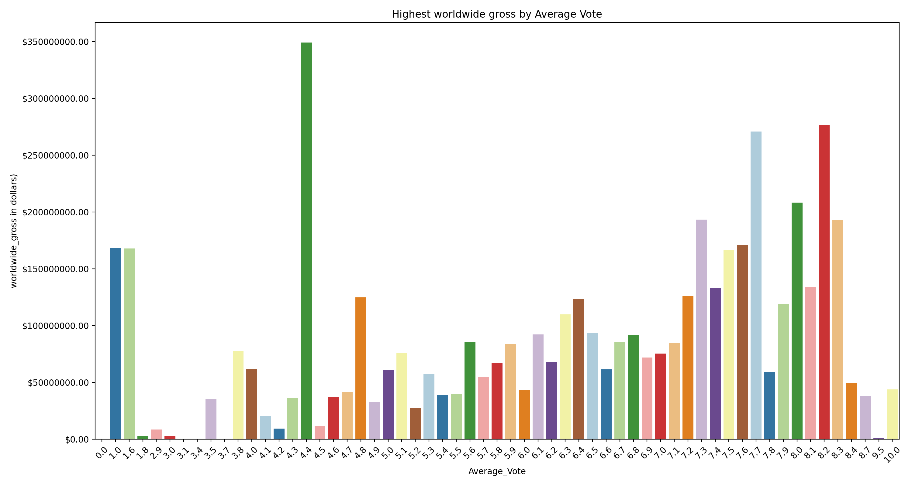

# Movie Industry Analysis for Microsoft

**Author**: [Namita Rana](mailto:namitarana21@gmail.com)

##  Overview
This proposal contains an analysis of various movie data in order to inform executive decision making regarding Microsoft's movie studio who is just about to venture into the movie making business. Specifically, it provides actionable insights with respect to what types of films the studio should focus on creating with the goal of maximizing box office performance. Initial descriptive analysis of box office performance and other movie data shows that box office earnings are related to genre, runtime,rating,release month of the movie and the language preferred by its target audience.
For this project, I will use exploratory data analysis to generate insights for a business stakeholder.

### Business Problem

Business Problem:
Microsoft is interested in developing original video content to remain competitive in the tech world by creating a movie studio. This project will examine the movie industry to provide a set of recommendations on where to get started. Using movie genre, movie runtime,WorldWide Gross,Average vote count,release month data, I identified patterns in box office performance to inform Microsoft's decision making as to what types of movies to produce in order to maximize profits.

 
### The Data

Data
Several data sets have been explored, but the following are included in the results:
* [Box Office Mojo](https://www.boxofficemojo.com/)
* [IMDB](https://www.imdb.com/)
* [TheMovieDB](https://www.themoviedb.org/)

For this exploratory analysis I have used following data files:

* imdb.title.basics
* tmdb.movies
* bom.movie_gross

### Measures of Success

* Genres that are gathering the highest worldwide gross: Because ultimately, a successful business venture should know which genre to invest in.
* Average Vote Count: We want people to like the movie! This helps in determining whether vote count helps in making a movie successful.
* Release Month: We want to gather maximum profit for a business ,knowing when to release a movie helps in maximizing those profits.
* Runtime : We want the audience to be captivated during the whole duration of the movie, so it's important to understand the average runtime that capture's the attention of audiences.
* Language: Since, in this digital age data is accesible to anyone.It's highly crucial to know which language people are most interersted in so as to maximize your audience which in turn help's to generate profits.


## Methods

This project utilizes descriptive analysis, including examination of correlation and relationship among variables. This provides insight for Microsoft into what key factors around a movie can lead to higher box office earnings.

#### The visuals were provided by manipulating the following variables:
  * Genres
  * WorldWide Gross
  * Average Vote Count
  * Popularity Count
  * Original Language
  * Runtime

## Results


### Graphs 

#### Genre generating the highest Worldwide Gross.

This graph demonstrates Genre generating the highest Worldwide Gross.
 
 
#### Language  most preferred by audiences Worldwide & Domestic
 
This bar plot demonstrates the languages preferred Domestically & Worldwide which are generating maximum Worldwide Gross and maximum domestic gross.

1.For Worldwide gross


2.For Domestic gross


#### Relationship between runtime of movies and their popularity.

This scatter plot demonstrates the the correlation between popularity count and runtime of a movie.


#### Most profitable year for the movie industry.

This graph shows the most profitable year for the movie industry.


#### Release Month that gathers the maximum Worldwide Gross.
This graph shows the month that has the maximum worlwide earnings.


#### Dependency of Worldwide Gross on Average vote count.

This plot shows the Worldwwide Gross of a movie also varies with it's average vote count. 



## Evaluations
***
This analysis provides five recommendations for Microsoft's new movie studio in order to take calculated business decisions.
Knowing the demography of your target audience is crucial,here is the list thatcan be taken into consideration.
* **Make movies of the highest grossing genres.** The movies that could be categorized in the Sci Fi, family & animation,   tended to have higher box office earnings. Microsoft should focus on these genres the most.
* **Runtime should not be overlooked.** In general, movies that had longer runtimes also had higher box office     earnings.However, once movies surpassed a runtime threshold, box office performance was hampered. Microsoft should focus on making movies within that sweet spot between 100 and 120 minutes.
* **Average vote count for a movie is important**,the above analysis shows even with an average rating the movie can perform well in generating profit.
* **Release Month for a movie everything.** The data showed that the movies released in a particular month tend to have higher box office earnings. Microsoft should prioritize making quality, well reviewed movies that can score at least a 6 on IMDb's scale.
* **Knowing the language preferred by your audience domestically and worldwide.** This plays a pivotal role in deciding how much audience you can gather, which will help the movie make profit.

## Findings

* **Genre generating the highest Worldwide Gross.** 
* Sci- Fi

* **Language  most preferred by audiences Worldwide & Domestic.**
* Worldwide : te 'Telegu'
* Domestic : en 'English

* **Relationship between runtime of movies and their popularity.**
* Positive Correlation within a timeframe of 100-120 Minutes.

* **Most profitable year for the movie industry.**
* 2017 was the most profitable year.

* **Release Month that gathers the maximum Worldwide Gross.**
* November

* **Dependency of Worldwide Gross on Average vote count.**
* Average Vote Count of 4.4 did well for the worldwide gross.


## For More Information

Please review my full analysis in [my Jupyter Notebok](/Movie_Industry_Analysis_for_Microsoft.ipynb).


For any additional questions,please contact Namita Rana at <namitarana21@gmail.com>


## Repository Structure

```
├── Images<- 
├── Docs
├── Microsoft Movie Analysis.pdf
├── Microsoft Movie Analysis_presentationpptx.pptx
├── Movie_Industry_Analysis_for_Microsoft.ipynb       
├── zipped data                               
└── Images                           
```


